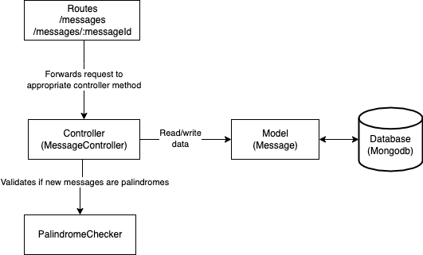
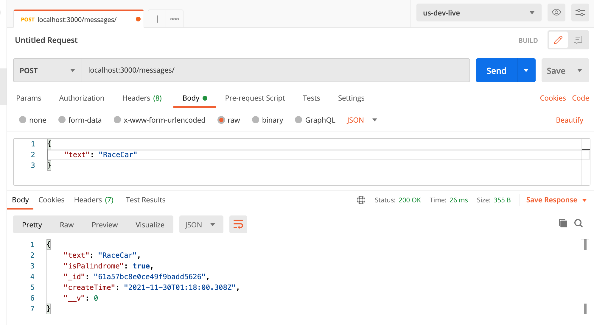

# Audition Message Board

This example message board is a REST API service which manages messages, providing their information and determining if they are palindromes. It is built in the Express Node.js framework, and as a REST API, provides create, retrieve, update and delete functions for messages, as well

The following diagram shows the architecture of the message board:



This API uses the common Route/Model/Controller architecture. The messages routes redirect request to the appropriate controller, which handles the API requests for each type of operation. 

This controller uses the Palindrome Checker operation to check if a new message is a palindrome before it is added or updated in the database. 

Finally, using a Mongoose Model, the controller reads and writes data to the MongoDB server, which is hosted locally.

&nbsp;

## API documentation

### GET /messages: 
Returns a list of all messages in the database.

Return format:
```
[
    {
        "_id": "61a57ef1fd01ca5a9347e4d7",
        "text": "SportsCar",
        "isPalindrome": false,
        "createTime": "2021-11-30T01:31:29.125Z",
        "__v": 0
    },
    {
        "_id": "61a57ef4fd01ca5a9347e4d9",
        "text": "RaceCar",
        "isPalindrome": true,
        "createTime": "2021-11-30T01:31:32.865Z",
        "__v": 0
    }
]
```
&nbsp;

### POST /messages: 
Adds a new message to the database.

Body format:
```
{
    text: String
}
```

Return format:
```
{
    "text": "RaceCar", \n
    "isPalindrome": true,
    "_id": "61a57bc8e0ce49f9badd5626",
    "createTime": "2021-11-30T01:18:00.308Z",
    "__v": 0
}
```
&nbsp;

### GET /messages/{messageId}:
Retrieves the message associated with messageId.

Return format:
```
{
    "_id": "61a57ef4fd01ca5a9347e4d9",
    "text": "RaceCar",
    "isPalindrome": true,
    "createTime": "2021-11-30T01:31:32.865Z",
    "__v": 0
}
```
&nbsp;

### PATCH /messages/{messageId}:
Retrieves the message associated with messageId.

Body format:
```
{
    text: String
}
```

Return format:
```
{
    "acknowledged": true,
    "modifiedCount": 1,
    "upsertedId": null,
    "upsertedCount": 0,
    "matchedCount": 1
}
```

&nbsp;

### DELETE /messages/{messageId}:
Retrieves the message associated with messageId.

Return format:
```
{
    "deletedCount": 1
}
```

&nbsp;

## Local Setup

To run the app locally, you must first have node, npm, and [mongodb installed](https://docs.mongodb.com/manual/tutorial/install-mongodb-on-os-x/#installing-mongodb-5.0-edition-edition).
&nbsp;


## Hosting the API:

First, clone the git repository onto a local workspace.

Next, install the node modules in the root folder of the project using `npm install`.

Then, [run the MongoDB community edition service](https://docs.mongodb.com/manual/tutorial/install-mongodb-on-os-x/#run-mongodb-community-edition).

Finally, run the service using `npm start`.

The API should now be available on `localhost:3000/messages/`, where you can send requests using any API client of your choosing. For example, posting a new message with Postman:



## Testing

To run the tests locally, you should first shut down the service if it is already open to avoid using the same port twice. Then, simply run `npm test` to execute the test suite.